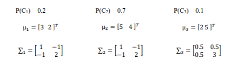
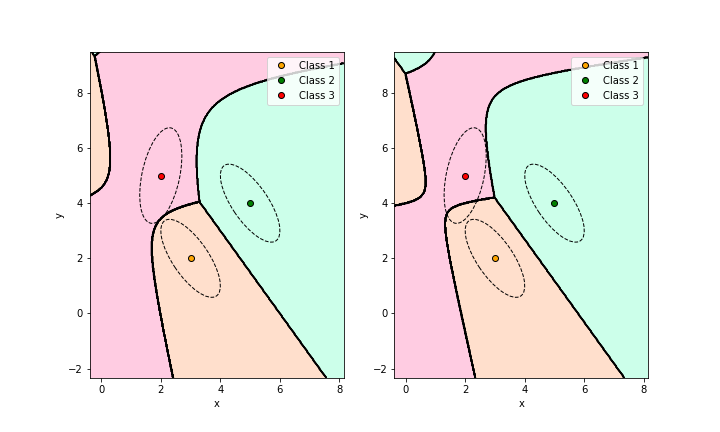

# Bayesian_Decision
Applies Bayesian decision  theory to a 2D problem with 3 classes decribed by priors, mean vectors and covariance matrices. 

The program completes two main goals:
  1) Plots the decision boundaries for a maximum likelihood (ML) and Maximum A Posteriori (MAP) decision rule alongside the means and first standard devaition contours for the classes.
  2) Generates a sample dataset from the class information and classifies the data using both ML and MAP classifers. The confusion matices are generated for both method and the experimental error rate is presented. 
  
The three classes used for the program have the following properties.

1) 

